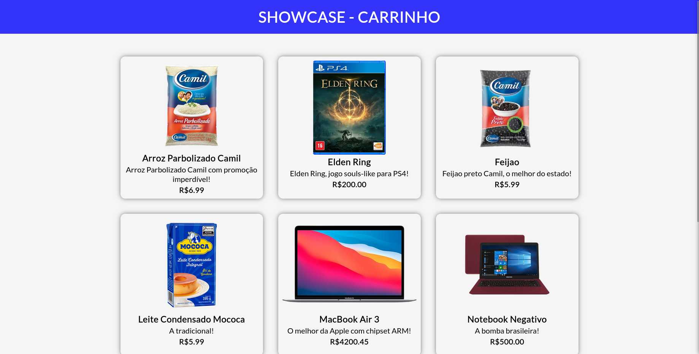
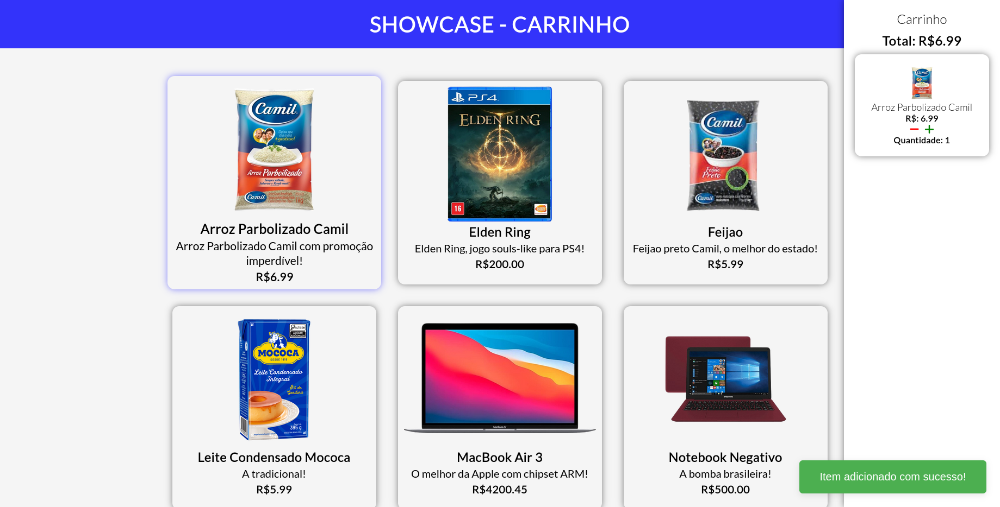
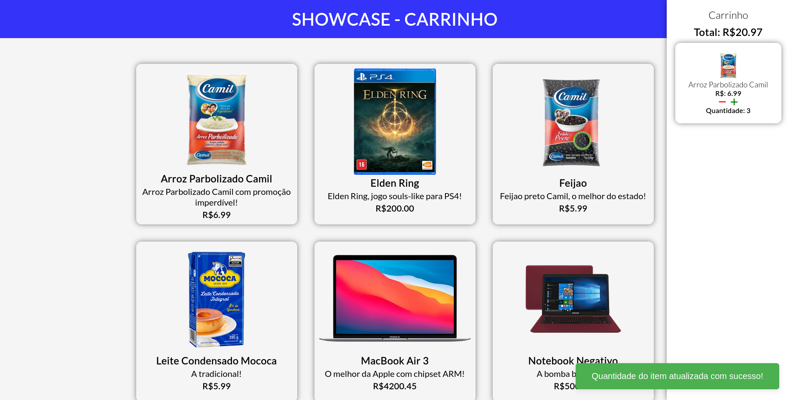
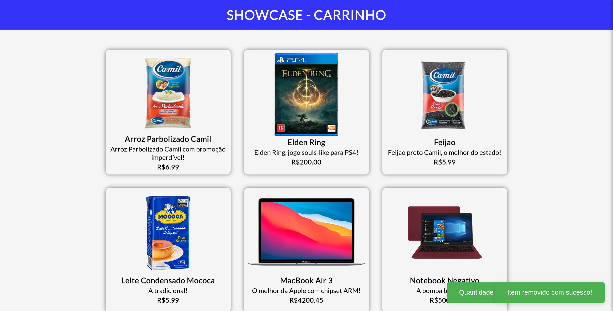

# INSTRUÇÕES PARA A MANIPULAÇÃO DO PROJETO v2 (FRONTEND e BACKEND)

1. O presente projeto foi programado em TypeScript, mas possui scripts para sua compilação em JavaScript caso necessário.
2. Primeiro certifique-se de ter todas as dependências do programa instalados, para isso utilize o comando `npm i` que irá automaticamente fazer o download de todas as dependências necessárias baseado no package.json.
3. Com base nos scripts que fiz para executar o programa, escrevi um script de compilação do código para javascript e execução automática, utilize o comando `npm run compile:start` para compilar e executar o programa.
4. A página responsável por todo o CRUD estará em `http://localhost:8000/`.
5. Este programa é um app monolítico, ambos o backend e frontend estão servidos pelo mesmo repositório
6. Se tudo correr bem essa será a aparência da página inicial, 
7. Ao clicar em um produto, um offcanvas irá aparecer na tela, com o produto selecionado, o total e a quantidade, 
8. Ao clicar novamente no mesmo produto, a quantidade irá aumentar pelo número de vezes clicados, 
9. No offcanvas, caso clique no ícone de "mais" de determinado produto, a quantidade aumentará pelo número de vezes clicados, 
10. Ainda no offcanvas, caso clique no ícone de "menos" de determinado produto, a quantidade diminuirá pelo número de vezes clicados, 
11. Caso elimine todos os produtos do offcanvas, ele se fechará automaticamente, 
12. A página possui conexão completa com o backend em tempo real, caso feche a página com produtos selecionados e recarregue, ela estará com todos os produtos selecionados anteriormente e com o offcanvas ativado.
13. Todo o armazenamento é feito em um arquivo `.json` chamado `chart.json`, nenhum banco de dados foi utilizado nesse projeto.

## DOCUMENTACAO DA API

1. O projeto utiliza de requisitos de parâmetros e requisitos de corpo de conteúdo(JSON).
2. MÉTODO GET para visualizar todos os produtos do carrinho, utilize o endereço `http://localhost:8000/api/`.
3. MÉTODO GET para visualizar apenas uma compra específica do carrinho, nesta será utilizada requisitos de parâmetro com a propriedade do id, como por exemplo `http://localhost:8000/api/{id}`, substituindo o `{id}`por um número que corresponda a um produto do carrinho.
4. MÉTODO POST para criar um produto e coloca-lo no carrinho, o endereço é `http://localhost:8000/api` , nesta será utilizada requisitos de corpo, da seguinte maneira:

```json
[
  // Exemplo
  {
    "id": 68,
    "productName": "Porta de aço",
    "price": 250.99,
    "quantity": 1
  }
  // Sendo id o identificador, productName o nome do produto, price o preço, quantity a quantidade
]
```

5. MÉTODO PUT para atualizar os dados de um produto, será utilizado tanto os requisitos de parâmetros como os requisitos de corpo neste método, o endereço é `http://localhost:8000/api/{id}`, substituindo o `{id}`pelo identificador do produto, em seguida deve-se definir as propriedades que serão atualizadas no corpo da requisição como:

```json
[
  // Exemplo
  {
    "id": 68,
    "productName": "Porta de madeira",
    "price": 123.57,
    "quantity": 1
  }
  // Sendo id o identificador, productName o nome do produto, price o preço, quantity a quantidade
]
```

6. MÉTODO DELETE, será utilizado somente os requisitos de parâmetros como no método GET para solicitar somente um produto, utiliza-se o endereço `http://localhost:8000/api/{id}`, substitua o `{id}`pelo identificador do produto, o produto será deletado e receberá uma mensagem de sucesso ou falha.
